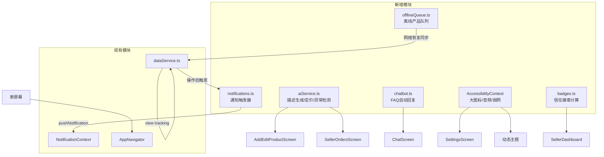

## 产品概述

将 Boutikplus 从基础版市场应用升级为世界级、差异化的社区市场平台，同时深度适配布基纳法索本地市场（弱网、低端手机、Mobile Money、法语），解决年轻人的核心痛点。

## 核心功能（按优先级）

### 1. 自动通知系统（强制）

- 卖家：新订单收到、付款凭证待验证、库存低/断货、新评价
- 买家：付款已验证→订单确认、新消息、24h 购物车放弃提醒
- 真实通知中心页面 + 铃铛角标实时联动

### 2. AI 自动化（高优先级，本地离线优先）

- 拍照自动生成产品标题+描述+分类（基于类别模板+图像启发式，无需云端 API）
- 基于平台同类产品的智能定价建议
- 卖家离线时聊天机器人自动回复 FAQ（价格/库存/配送/尺码颜色）
- 一键生成 WhatsApp/社媒促销 flyer（产品信息合成图片，可分享）
- 付款截图基础异常检测（模糊/重复/可疑）辅助卖家防欺诈

### 3. 高级卖家统计

- 日/周/月营收图表、最畅销/最浏览产品、转化率（浏览→订单）、新老客户对比、环比上月

### 4. 无障碍

- 大图标少文字模式、音频朗读模式（expo-speech 离线 TTS 读价格/描述/订单状态）、弱网模式（自动压缩+离线加产品后自动同步）

### 5. 增长与竞争力

- 一键分享公开店铺链接（WhatsApp/Facebook/Instagram，无需下载 App 即可看目录）、信任徽章（已验证/快速配送/月度 Top）、简单推荐计划

## 约束

- AI 全部本地运行（模板+启发式），不依赖外部 LLM API（适配弱网与零成本）；预留可选 `EXPO_PUBLIC_AI_API_URL` 钩子
- 100% 法语界面，设计延续 Jumia 风格（橙色 #FF6B00），适配入门手机

## 技术栈

### 新增依赖（package.json）

- `expo-speech` ~12.0.0 — 离线语音合成（音频朗读模式）
- `expo-sharing` ~13.0.0 — 分享 flyer / 店铺链接
- `react-native-view-shot` ~4.0.0 — 捕获促销 flyer 视图为图片
- `expo-linking` ~7.0.0 — 公开店铺深度链接
- `expo-network` ~7.0.0 — 网络状态检测（离线队列同步）
- `@react-native-async-storage/async-storage` — 已安装，复用于离线队列+无障碍设置持久化

### 实现方案

**整体策略**：所有新功能遵循"离线优先"原则——AI、聊天机器人、通知、统计均可在无网络/无 Supabase 的演示模式下工作，数据来自 `dataService.ts` 统一层和 `demoData.ts`。新增模块通过纯函数/Context 解耦，不侵入现有架构。

**关键技术决策**：

1. **AI 本地引擎**（`src/lib/aiService.ts`）：不调用云端 LLM。产品描述生成 = 类别模板库（每类 8-12 个法语模板）+ 图片色彩启发式（通过 expo-image-manipulator 获取平均色调推断主色）+ 随机变化。定价建议 = 同类产品价格中位数±20%。付款异常检测 = 文件大小阈值（<30KB 疑似模糊）+ 简单感知哈希比对已用截图（防重复）。预留 `EXPO_PUBLIC_AI_API_URL` 可选钩子，配置后优先调用真实视觉模型。

2. **聊天机器人**（`src/lib/chatbot.ts`）：规则引擎，法语关键词匹配（prix/livraison/disponible/taille/couleur/quand/où/bonjour/merci），从店铺+产品数据生成上下文回复。当卖家最后一条消息超过 5 分钟（演示模式即时触发）自动插入机器人回复，带"🤖 Réponse automatique"标记。

3. **通知系统**（`src/lib/notifications.ts` + 重写 `NotificationContext`）：`NotificationContext` 持有通知列表 `AppNotification[]`（id/type/title/body/read/createdAt/data），提供 `pushNotification()`、`markAsRead()`、`unreadCount`。`dataService.ts` 在关键操作（createOrder→卖家收新订单、uploadPaymentProof→卖家待验证、validatePayment→买家已确认、sendMessage→新消息、createReview→卖家新评价）后调用 `pushNotification`。演示模式注入示例通知；生产模式订阅 Supabase Realtime `notifications` 表。

4. **统计图表**（`src/components/charts/BarChart.tsx`）：纯 RN 视图组件（无 SVG 依赖），竖条形图渲染日/周/月营收，带触控 tooltip。新增 `trackProductView()` 在 `dataService` 中记录浏览数（演示模式用 demoData 的 `views` 字段），计算转化率 = 订单数/浏览数。

5. **无障碍**（`src/context/AccessibilityContext.tsx`）：全局 Context 持有 `largeIcons`/`audioMode`/`lowDataMode`，持久化 AsyncStorage。`AudioButton` 组件用 expo-speech 朗读文本。`offlineQueue.ts` 用 AsyncStorage 存储离线创建的产品，监听 expo-network 网络恢复后自动同步。

6. **信任徽章**（`src/lib/badges.ts`）：纯客户端计算——`verified`（≥5 单已交付）、`fast_delivery`（平均响应<2h）、`top_seller`（月度销量 Top 3）、`trusted`（评分≥4.5 且 ≥10 评价）。`TrustBadges` 组件渲染彩色徽章。

7. **促销 Flyer**（`src/components/PromoFlyer.tsx`）：组合视图（产品图+名称+价格+店铺 logo+促销文案+橙色渐变背景），`react-native-view-shot` 捕获为 PNG，`expo-sharing` 分享到 WhatsApp/社媒。

### 性能与可靠性

- AI 生成在主线程同步执行（<5ms，纯字符串模板），无阻塞
- 通知列表上限 50 条，超出自动裁剪旧通知
- 离线队列同步使用指数退避重试，失败保留队列不丢失
- 图表数据在屏幕加载时一次性计算，不重复遍历
- Realtime 订阅在组件卸载时立即取消（防内存泄漏）

### 架构设计



### 目录结构

```
boutikplus/
├── package.json                                  # [MODIFY] 添加 expo-speech/sharing/view-shot/linking/network
├── src/
│   ├── lib/
│   │   ├── aiService.ts                          # [NEW] AI本地引擎：描述生成/定价建议/付款异常检测/感知哈希
│   │   ├── chatbot.ts                            # [NEW] 规则引擎：法语关键词匹配+上下文回复生成
│   │   ├── notifications.ts                      # [NEW] 通知触发器：7种通知类型+创建函数
│   │   ├── badges.ts                             # [NEW] 信任徽章计算：verified/fast/top/trusted
│   │   ├── offlineQueue.ts                       # [NEW] 离线产品队列：AsyncStorage+网络监听同步
│   │   ├── dataService.ts                        # [MODIFY] 添加通知触发/浏览追踪/徽章数据/推荐统计
│   │   ├── format.ts                             # [MODIFY] 添加朗读文本格式化辅助
│   │   └── storage.ts                            # [保持] 图片压缩上传
│   ├── context/
│   │   ├── NotificationContext.tsx               # [MODIFY] 重写为真实通知列表系统
│   │   ├── AccessibilityContext.tsx              # [NEW] 大图标/音频/弱网模式+AsyncStorage持久化
│   │   ├── AuthContext.tsx                       # [保持]
│   │   └── CartContext.tsx                       # [MODIFY] 添加24h放弃提醒逻辑
│   ├── components/
│   │   ├── charts/
│   │   │   └── BarChart.tsx                      # [NEW] 纯RN竖条形图组件（日/周/月营收）
│   │   ├── AudioButton.tsx                       # [NEW] TTS朗读按钮（expo-speech）
│   │   ├── TrustBadges.tsx                       # [NEW] 信任徽章展示组件
│   │   ├── PromoFlyer.tsx                        # [NEW] 促销flyer合成视图（view-shot捕获）
│   │   ├── NotificationItem.tsx                  # [NEW] 通知列表项组件
│   │   ├── ui/Button.tsx                         # [MODIFY] 支持 largeIcons 变体
│   │   └── navigation/BottomTabBar.tsx           # [MODIFY] 支持大图标模式
│   ├── screens/
│   │   ├── NotificationsScreen.tsx               # [NEW] 通知中心：列表+筛选+标记已读
│   │   ├── ReferralScreen.tsx                    # [NEW] 推荐计划：邀请码+奖励说明
│   │   ├── ShopPreviewScreen.tsx                 # [NEW] 公开店铺预览（可分享）
│   │   ├── seller/
│   │   │   ├── SellerStatsScreen.tsx             # [MODIFY] 高级统计+图表+转化率+环比
│   │   │   ├── AddEditProductScreen.tsx          # [MODIFY] AI生成描述按钮+定价建议
│   │   │   ├── SellerOrdersScreen.tsx            # [MODIFY] 付款异常检测提示
│   │   │   ├── SellerDashboardScreen.tsx         # [MODIFY] 徽章展示+分享店铺按钮
│   │   │   └── PromotionsScreen.tsx              # [MODIFY] 一键生成flyer按钮
│   │   ├── messages/ChatScreen.tsx               # [MODIFY] 集成聊天机器人自动回复
│   │   ├── home/HomeScreen.tsx                   # [MODIFY] 通知铃铛连真实系统
│   │   └── profile/SettingsScreen.tsx            # [MODIFY] 无障碍选项面板
│   ├── navigation/
│   │   └── AppNavigator.tsx                      # [MODIFY] 添加Notifications/Referral/ShopPreview路由
│   ├── types/
│   │   └── models.ts                             # [MODIFY] 添加TrustBadge/NotificationType/OfflineProduct类型
│   └── data/
│       └── demoData.ts                           # [MODIFY] 添加产品浏览数/徽章数据/推荐数据
```

### 关键代码结构

```typescript
// src/types/models.ts — 新增类型

export type NotificationType =
  | 'new_order'           // 卖家：新订单
  | 'payment_to_validate' // 卖家：待验证付款
  | 'payment_confirmed'   // 买家：付款已确认
  | 'new_message'         // 新消息
  | 'low_stock'           // 卖家：库存低
  | 'cart_abandoned'      // 买家：购物车放弃
  | 'new_review';         // 卖家：新评价

export type TrustBadgeType = 'verified' | 'fast_delivery' | 'top_seller' | 'trusted';

export interface TrustBadge {
  type: TrustBadgeType;
  label: string;       // "Vendeur vérifié"
  icon: string;
  color: string;
}

// src/lib/aiService.ts — AI本地引擎接口

export interface AIGeneratedProduct {
  title: string;
  description: string;
  categoryId: string;
  suggestedPrice: number;
  confidence: number; // 0-1
}

export async function generateProductFromImage(
  imageUri: string,
): Promise<AIGeneratedProduct>;

export function suggestPrice(
  categoryId: string,
  similarProducts: ProductWithImages[],
): { suggested: number; min: number; max: number };

export interface PaymentAnomaly {
  isBlurry: boolean;
  isDuplicate: boolean;
  warnings: string[];
}

export async function detectPaymentAnomaly(
  imageUri: string,
  knownProofs: string[],
): Promise<PaymentAnomaly>;

// src/lib/chatbot.ts — 聊天机器人接口

export function generateBotReply(
  userMessage: string,
  context: { shop?: Shop; product?: ProductWithImages },
): string | null; // null=无法回答，转人工
```

延续现有 Jumia 风格设计系统（橙色 #FF6B00 主色、卡片圆角、Poppins 字体）。新增页面保持视觉一致性：通知中心使用图标+彩色标签区分类型；统计页新增竖条形图（橙色渐变柱、触控高亮）；AI 生成结果以浮动卡片展示带"✨ IA"标记；信任徽章为小型彩色 pill 标签；促销 flyer 为全屏竖版卡片（产品大图+橙色渐变叠加+白色大字价格+店铺 logo）。无障碍大图标模式统一放大所有图标 1.5x 并增大触控区域。音频按钮为圆形橙色播放图标。

## Agent Extensions

### Skill

- **多模态内容生成**
- Purpose: 为促销 flyer 功能生成 3-4 张精美的非洲风格渐变背景模板图（橙色/紫色/绿色节庆图案），作为 flyer 合成时的可选背景层，提升分享到 WhatsApp/社媒时的视觉冲击力
- Expected outcome: 生成 4 张 1080x1920 竖版背景图，存入 `assets/images/flyer-bg/`，供 `PromoFlyer.tsx` 随机选用，使一键生成的 flyer 达到可直接分享的精美程度