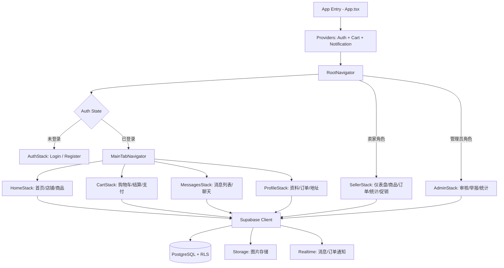

## 产品概述

Boutikplus 是一款面向布基纳法索年轻学生和青年创业者的社区移动市场应用。它作为一个"迷你 Shopify"社区平台，适配当地非正规商业场景和 Mobile Money 支付方式，让用户能够轻松创建店铺、发布商品、浏览购买并完成移动支付。

## 核心功能

### 用户角色

- **买家**：浏览店铺和商品、下单、Mobile Money 支付（截图上传凭证）、追踪订单状态、与卖家聊天议价
- **卖家**：3分钟内创建店铺、添加/管理商品、处理订单并手动验证付款、查看销售统计、发布促销
- **管理员**：审核店铺、处理举报、查看平台全局统计

### 核心业务流程

- **Mobile Money 手动支付流程**（关键特色）：显示卖家 Orange Money / Moov Money 号码 → 买家自行转账 → 上传付款截图 → 卖家手动确认收款 → 订单状态流转
- **订单状态链**：待付款 → 凭证已上传 → 卖家已验证 → 配送中 → 已送达 / 已取消

### 主要页面

1. 首页/探索：精选店铺和商品、搜索栏、按分类和城市筛选
2. 店铺详情：卖家目录、联系信息、客户评价、关注按钮
3. 商品详情：多图轮播、描述、FCFA 价格、加入购物车/立即购买
4. 购物车/结算：订单摘要、配送地址选择、总计
5. Mobile Money 支付：卖家号码+复制按钮、付款截图上传、状态追踪
6. 卖家仪表盘：商品管理、订单处理+付款验证、销售统计、促销创建
7. 即时消息：买卖双方实时聊天
8. 用户资料：个人信息、订单历史、配送地址管理
9. 管理后台：店铺审核、举报处理、全局统计

### 本地化规则

- 货币：FCFA（西非法郎）
- 支付：仅 Orange Money 和 Moov Money，无银行卡
- 付款验证：卖家手动通过截图确认（无自动支付 API）
- 主要城市：瓦加杜古、博博迪乌拉索、库杜古、瓦希古亚等
- 全法语界面，轻量化设计适配低端手机和弱网环境

## 技术栈

### 前端

- **React Native + Expo**（managed workflow）+ **TypeScript**
- **React Navigation v6**：Native Stack + Bottom Tabs 嵌套导航
- **状态管理**：React Context + 自定义 Hooks（AuthContext / CartContext / NotificationContext），不使用 Redux 以保持轻量
- **样式**：StyleSheet 原生方案 + 集中化主题系统（colors / spacing / typography），不使用 NativeWind 以减小包体积
- **图片**：expo-image-picker（选图）+ expo-image-manipulator（压缩）+ expo-image（缓存加载）
- **图标**：@expo/vector-icons（Feather / MaterialCommunityIcons）
- **Supabase JS 客户端**：@supabase/supabase-js（Auth + PostgreSQL + Storage + Realtime）

### 后端 (Supabase)

- **PostgreSQL**：17张表 + Row Level Security (RLS) 策略
- **Auth**：邮箱/电话注册，JWT 会话管理
- **Storage**：3个存储桶（shop-logos / product-images / payment-proofs）
- **Realtime**：消息聊天 + 订单状态变更通知

## 实现方案

### 整体策略

采用分层架构（表现层 → 业务逻辑层 → 数据层），所有数据访问通过 Supabase RLS 保护，无需自定义 API 层。前端通过自定义 Hooks 封装 Supabase 查询，实现关注点分离。

### 关键技术决策

1. **RLS 代替 API 层**：Supabase PostgREST + RLS 直接从客户端安全访问数据库，减少架构复杂度，适合 MVP 快速开发
2. **手动支付流程**：不集成支付 API，完全通过截图上传 + 卖家手动确认实现，符合布基纳法索实际情况
3. **图片压缩**：上传前用 expo-image-manipulator 压缩至最大 800px 宽、JPEG 0.7 质量，适配弱网
4. **Realtime 订阅**：仅订阅当前会话相关的消息和订单，组件卸载时立即取消订阅，避免内存泄漏
5. **购物车内存态**：购物车数据保持在 Context 内存中，不频繁写数据库，仅在下单时持久化

### 性能与可靠性

- 商品列表分页加载（每页 20 条），避免一次性拉取大量数据
- 图片懒加载 + expo-image 磁盘缓存，减少重复下载
- FCFA 格式化使用 Intl.NumberFormat，无额外依赖
- 网络请求失败时显示重试按钮，不静默吞错

### 架构设计



### 数据库表结构（17张表）

1. **profiles** — 扩展 auth.users：full_name, phone, city, role(buyer/seller/admin), avatar_url
2. **categories** — 参考表：name, icon, sort_order
3. **shops** — owner_id, name, description, logo_url, banner_url, category_id, city, orange_money_number, moov_money_number, status(active/paused)
4. **products** — shop_id, name, description, price(FCFA), category_id, stock, status(available/out_of_stock)
5. **product_images** — product_id, image_url, position
6. **cart_items** — user_id, product_id, quantity
7. **orders** — buyer_id, seller_id, total_amount, delivery_address_id, status
8. **order_items** — order_id, product_id, quantity, unit_price
9. **payments** — order_id, amount, operator(orange_money/moov_money), proof_image_url, status(pending/validated/rejected)
10. **delivery_addresses** — user_id, city, district, instructions, contact_phone
11. **reviews** — user_id, shop_id(nullable), product_id(nullable), rating(1-5), comment
12. **promotions** — shop_id, product_id, promo_text, start_date, end_date, visibility(home/category), status
13. **conversations** — buyer_id, seller_id, shop_id
14. **messages** — conversation_id, sender_id, content, image_url
15. **shop_follows** — user_id, shop_id
16. **reports** — reporter_id, target_type(shop/product), target_id, reason, status
17. **notifications** — user_id, type, title, body, data(json), read

### RLS 策略要点

- 公开可读：status=active 的 shops、status=available 的 products、categories
- 认证用户：创建自己的 shop / product / order / address / review / message
- 卖家：读写自己 shop 的 products，验证自己订单的 payments
- 买家：查看自己的 orders / cart / addresses，仅会话参与者可读写 messages
- 管理员：全部表的完整 CRUD 权限

## 目录结构

```
boutikplus/
├── App.tsx                              # [NEW] 入口：Provider 包装 + RootNavigator
├── app.json                             # [NEW] Expo 配置（名称、图标、splash）
├── package.json                         # [NEW] 依赖声明
├── tsconfig.json                        # [NEW] TypeScript 配置
├── babel.config.js                      # [NEW] Babel 配置（expo preset）
├── .env                                 # [NEW] Supabase URL + Anon Key
├── src/
│   ├── navigation/
│   │   ├── RootNavigator.tsx            # [NEW] 根导航：Auth/Main 切换 + Seller/Admin 模态栈
│   │   ├── AuthNavigator.tsx            # [NEW] 登录/注册栈
│   │   ├── MainTabNavigator.tsx         # [NEW] 底部 Tab：首页/搜索/购物车/消息/资料
│   │   ├── SellerNavigator.tsx          # [NEW] 卖家仪表盘栈
│   │   └── AdminNavigator.tsx           # [NEW] 管理员栈
│   ├── screens/
│   │   ├── auth/
│   │   │   ├── LoginScreen.tsx          # [NEW] 登录页（邮箱/电话+密码）
│   │   │   └── RegisterScreen.tsx       # [NEW] 注册页（姓名/电话/城市/角色选择）
│   │   ├── home/
│   │   │   ├── HomeScreen.tsx           # [NEW] 首页：搜索栏/分类/促销轮播/精选店铺/热门商品
│   │   │   ├── SearchScreen.tsx         # [NEW] 搜索+筛选（分类/城市/价格）
│   │   │   ├── ShopDetailScreen.tsx     # [NEW] 店铺详情：目录/联系/评价/关注
│   │   │   └── ProductDetailScreen.tsx  # [NEW] 商品详情：图轮播/描述/价格/加购/联系卖家
│   │   ├── cart/
│   │   │   ├── CartScreen.tsx           # [NEW] 购物车列表+数量调整+小计
│   │   │   ├── CheckoutScreen.tsx       # [NEW] 结算：地址选择+订单摘要+总计
│   │   │   ├── PaymentScreen.tsx        # [NEW] Mobile Money 支付：号码显示+复制+截图上传
│   │   │   └── OrderConfirmationScreen.tsx # [NEW] 订单确认+状态追踪时间线
│   │   ├── messages/
│   │   │   ├── ConversationListScreen.tsx # [NEW] 会话列表
│   │   │   └── ChatScreen.tsx            # [NEW] 实时聊天界面
│   │   ├── profile/
│   │   │   ├── ProfileScreen.tsx         # [NEW] 个人资料+角色切换入口
│   │   │   ├── OrdersScreen.tsx          # [NEW] 订单历史+状态筛选
│   │   │   ├── AddressesScreen.tsx       # [NEW] 配送地址 CRUD
│   │   │   └── SettingsScreen.tsx        # [NEW] 设置：通知/语言/登出
│   │   ├── seller/
│   │   │   ├── CreateShopScreen.tsx      # [NEW] 创建店铺向导（名称/分类/城市/MM号码）
│   │   │   ├── SellerDashboardScreen.tsx # [NEW] 仪表盘：统计卡片+快捷操作+最近订单
│   │   │   ├── ProductManagementScreen.tsx # [NEW] 商品列表+添加/编辑/删除/库存
│   │   │   ├── AddEditProductScreen.tsx  # [NEW] 添加/编辑商品表单（多图上传）
│   │   │   ├── SellerOrdersScreen.tsx    # [NEW] 订单管理+付款验证按钮
│   │   │   ├── SellerStatsScreen.tsx     # [NEW] 销售统计+热销商品
│   │   │   └── PromotionsScreen.tsx      # [NEW] 促销创建/管理
│   │   └── admin/
│   │       ├── AdminDashboardScreen.tsx  # [NEW] 管理首页+全局统计
│   │       ├── ShopValidationScreen.tsx  # [NEW] 店铺审核列表
│   │       └── ReportsScreen.tsx         # [NEW] 举报处理
│   ├── components/
│   │   ├── ui/                           # [NEW] 通用UI组件
│   │   │   ├── Button.tsx                # 按钮（primary/secondary/outline 变体）
│   │   │   ├── Input.tsx                 # 文本输入（带标签/错误提示）
│   │   │   ├── Card.tsx                  # 卡片容器
│   │   │   ├── Badge.tsx                 # 状态标签
│   │   │   ├── Rating.tsx                # 星级评分（显示+交互）
│   │   │   ├── ImageCarousel.tsx         # 图片轮播（ScrollView + 分页）
│   │   │   ├── EmptyState.tsx            # 空状态占位
│   │   │   ├── LoadingSpinner.tsx        # 加载动画
│   │   │   └── CopyButton.tsx            # 复制到剪贴板按钮
│   │   ├── product/
│   │   │   ├── ProductCard.tsx           # 商品卡片（图+名+价+店铺）
│   │   │   └── ProductGrid.tsx           # 2列商品网格
│   │   ├── shop/
│   │   │   ├── ShopCard.tsx              # 店铺卡片
│   │   │   └── ShopHeader.tsx            # 店铺头部（logo/名称/关注按钮）
│   │   ├── order/
│   │   │   ├── OrderCard.tsx             # 订单卡片
│   │   │   └── OrderStatusBadge.tsx      # 订单状态标签（彩色映射）
│   │   └── payment/
│   │       ├── MobileMoneyInfo.tsx       # MM号码展示+运营商logo
│   │       └── PaymentProofUpload.tsx    # 截图上传组件
│   ├── context/
│   │   ├── AuthContext.tsx               # 认证状态+用户资料+角色
│   │   ├── CartContext.tsx               # 购物车增删改+总计计算
│   │   └── NotificationContext.tsx       # 未读消息/订单通知计数
│   ├── hooks/
│   │   ├── useAuth.ts                    # 认证操作封装
│   │   ├── useShops.ts                   # 店铺查询/筛选
│   │   ├── useProducts.ts               # 商品查询/分页
│   │   ├── useOrders.ts                  # 订单创建/查询/状态更新
│   │   ├── useMessages.ts                # 实时消息订阅+发送
│   │   ├── useImageUpload.ts             # 图片选择+压缩+上传
│   │   └── useNotifications.ts           # 通知订阅
│   ├── lib/
│   │   ├── supabase.ts                   # Supabase 客户端初始化
│   │   ├── storage.ts                    # Storage 上传辅助函数
│   │   └── format.ts                     # FCFA 格式化/日期/电话号码工具
│   ├── theme/
│   │   ├── colors.ts                     # 色彩系统
│   │   ├── spacing.ts                    # 间距常量
│   │   ├── typography.ts                 # 字体尺寸/粗细
│   │   └── index.ts                      # 合并导出
│   ├── types/
│   │   ├── database.ts                   # Supabase 表类型映射
│   │   ├── models.ts                     # 领域模型类型
│   │   └── navigation.ts                 # 导航参数类型
│   ├── constants/
│   │   ├── cities.ts                     # 布基纳法索城市列表
│   │   ├── categories.ts                 # 商品分类列表
│   │   └── payment.ts                    # Mobile Money 运营商常量
│   └── data/
│       └── seed.ts                       # [NEW] 演示数据种子脚本
├── supabase/
│   ├── schema.sql                        # [NEW] 全部表定义+枚举类型
│   ├── policies.sql                      # [NEW] RLS 策略
│   ├── storage.sql                       # [NEW] 存储桶+策略
│   └── seed.sql                          # [NEW] 演示数据 SQL
└── assets/
    ├── images/                           # [NEW] 应用图标/splash/占位图
    └── fonts/                            # [NEW] Poppins 字体文件
```

## 关键代码结构

```typescript
// src/types/models.ts — 核心领域类型

// 订单状态流转（Mobile Money 手动支付核心流程）
type OrderStatus =
  | 'pending_payment'    // 待付款
  | 'proof_uploaded'     // 凭证已上传，待卖家验证
  | 'payment_validated'  // 卖家已确认收款
  | 'in_delivery'        // 配送中
  | 'delivered'          // 已送达
  | 'cancelled';         // 已取消

type PaymentOperator = 'orange_money' | 'moov_money';
type PaymentStatus = 'pending' | 'validated' | 'rejected';
type UserRole = 'buyer' | 'seller' | 'admin';
type ShopStatus = 'active' | 'paused';
type ProductStatus = 'available' | 'out_of_stock';

interface Shop {
  id: string;
  owner_id: string;
  name: string;
  description: string | null;
  logo_url: string | null;
  banner_url: string | null;
  category_id: string;
  city: string;
  orange_money_number: string | null;
  moov_money_number: string | null;
  status: ShopStatus;
  created_at: string;
}

interface Payment {
  id: string;
  order_id: string;
  amount: number;              // FCFA
  operator: PaymentOperator;
  proof_image_url: string | null;
  status: PaymentStatus;
  created_at: string;
  validated_at: string | null;
}
```

## 实现注意事项

- **图片上传**：所有图片上传前通过 expo-image-manipulator 压缩（最大 800px 宽，JPEG 0.7），减少弱网下的上传时间和 Storage 用量
- **Realtime 生命周期**：ChatScreen 和 OrderConfirmationScreen 中 useEffect 订阅 Supabase Realtime channel，cleanup 函数必须调用 `channel.unsubscribe()` 防止内存泄漏
- **RLS 安全**：payments 表 status 字段仅允许 seller_id 匹配 order.seller_id 的用户更新为 validated/rejected，买家无法自行确认付款
- **FCFA 格式化**：统一使用 `new Intl.NumberFormat('fr-FR').format(amount) + ' FCFA'`，封装在 `src/lib/format.ts` 中全局复用
- **购物车跨店铺**：购物车中不同卖家的商品在下单时拆分为多个独立订单（每个卖家一个订单），因为 Mobile Money 付款是向卖家个人号码转账
- **导航参数类型**：React Navigation 的 param 类型在 `src/types/navigation.ts` 中集中定义，所有 Stack/Tab 的 route params 强类型化
- **离线容错**：关键操作（下单、上传凭证）失败时保留表单数据并显示重试，不跳转丢失用户输入
- **包体积控制**：不引入 UI 组件库（如 react-native-paper），使用原生 StyleSheet + 自建组件，保持轻量适配低端设备

## 设计风格

采用灵感来源于 Jumia 等非洲电商平台的现代彩色移动端设计。整体风格充满活力、温暖且可信赖，以橙色为主色调传达能量与社区感，辅以紫色和绿色作为功能区分。卡片式布局、圆角元素、微交互动画营造现代感。界面全部使用法语，布局简洁直观，确保低端手机上也能流畅体验。

## 页面规划（6个核心页面）

### 页面1：首页 / Explorer

- **顶部栏**：左侧 "Boutikplus" logo + 城市选择器下拉，右侧通知铃铛带红点
- **搜索栏**：圆角搜索输入框，placeholder "Rechercher un produit, une boutique..."，带搜索图标
- **分类胶囊**：横向滚动分类按钮（Vêtements / Cosmétiques / Nourriture / Artisanat / Services），选中态橙色填充
- **促销轮播**：横向滑动横幅卡片，展示活动促销，带渐变背景和文案
- **精选店铺**：横向滚动店铺卡片（logo + 名称 + 城市 + 评分），点击进入店铺
- **热门商品**：2列网格商品卡片（图片 + 名称 + FCFA价格 + 店铺名），下拉加载更多
- **底部导航栏**：5个 Tab（Accueil / Recherche / Panier / Messages / Profil），购物车带数量角标

### 页面2：商品详情 Fiche Produit

- **图片轮播**：全宽可滑动图片轮播，左上返回按钮，底部圆点分页指示器
- **商品信息**：商品名称（大号粗体）、FCFA 价格（橙色强调）、店铺名链接、星级评分
- **状态标签**：库存状态 Badge（绿色"En stock" / 红色"Rupture"）+ 分类标签
- **描述区**：可展开商品描述文本，分隔线区分
- **卖家操作**："Contacter le vendeur" 按钮（打开聊天）+ "Voir la boutique" 链接
- **底部操作栏**：固定底部，"Ajouter au panier"（描边按钮）+ "Commander maintenant"（橙色实心按钮）

### 页面3：Mobile Money 支付

- **订单摘要**：卡片显示商品列表、数量、小计和总计（FCFA 大号橙色）
- **运营商选择**：Orange Money / Moov Money 两个可选卡片（带各自 logo 和品牌色）
- **号码展示**：卖家 MM 号码大字显示 + "Copier le numéro" 按钮（点击后显示 "Copié!" 反馈）
- **操作指引**：3步骤说明卡片（1.转账 2.截图 3.上传凭证），带数字图标
- **截图上传**：虚线框上传区域，支持拍照或相册选择，上传后显示缩略图预览
- **提交按钮**："Envoyer la preuve de paiement" 橙色全宽按钮，点击后跳转确认页

### 页面4：卖家仪表盘

- **仪表盘头部**：店铺名称 + 状态开关（Actif/En pause）+ 编辑按钮
- **统计卡片**：3个并排卡片（Ventes du mois / Commandes en attente / Produits actifs），带图标和数字
- **快捷操作**：4个图标按钮网格（Ajouter produit / Voir commandes / Créer promo / Statistiques）
- **最近订单**：订单列表，每条显示买家名+金额+状态Badge，待验证订单高亮"Confirmer"按钮
- **热销商品**：横向滚动 Top 5 商品（图片+名称+销量），带排名序号
- **底部导航**：卖家专属 Tab（Tableau de bord / Produits / Commandes / Promos）

### 页面5：即时消息 Messagerie

- **聊天头部**：对方头像 + 名称 + 在线状态 + "Voir la boutique" 链接
- **商品引用卡片**：若从商品详情发起，顶部显示商品缩略图+名称+价格卡片
- **消息气泡**：发送消息右对齐橙色气泡，接收消息左对齐白色气泡，带时间戳
- **图片消息**：支持发送图片消息，点击可全屏查看
- **输入栏**：固定底部，图片按钮 + 文本输入 + 发送按钮（有内容时变橙色激活）

### 页面6：购物车 / Commande

- **购物车列表**：每个商品行（缩略图 + 名称 + 单价 + 数量增减按钮 + 删除按钮），按卖家分组
- **配送地址**：地址选择卡片（默认地址）+ "Ajouter une adresse" 按钮，点击展开地址表单
- **地址表单**：城市下拉 + Quartier 输入 + 指示说明 + 联系电话，保存后折叠显示
- **费用明细**：小计 + 配送费 + 总计（FCFA 大号橙色），分隔线清晰
- **订单备注**：可折叠的备注输入框
- **结算按钮**："Procéder au paiement" 橙色全宽固定底部按钮

## Agent Extensions

### Skill

- **多模态内容生成**
- Purpose: 为演示数据生成逼真的商品图片和店铺 logo，包括服装、化妆品、食品、手工艺品等品类，使应用在首次运行时即可展示完整可演示的视觉效果
- Expected outcome: 生成 15-20 张演示用商品图片和 5-6 张店铺 logo 图片，覆盖不同商品分类，用于填充 seed 数据使应用立即可演示